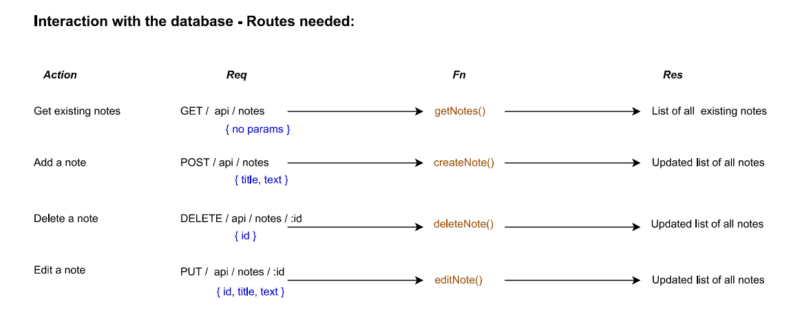

# Note taker


A note taking app using node.js, express.js and a frontend html interface for interaction with the user.

## Table of Content

- [Summary](#summary)
- [Screenshots of the application](#screenshots-of-the-application)
- [Detailed user story](#detailed-user-story)
- [Routes](#routes)
- [File structure](#file-structure)
- [Installation](#installation)
- [Contact](#contact)

## Summary

This application allows a user to write and save notes so that they can organise their thoughts and keep track of what they need to do.

Github repo: [https://github.com/Am0031/note-taker/tree/dev](https://github.com/Am0031/note-taker/tree/dev)

Heroku deployed page: [https://peaceful-bastion-97815.herokuapp.com/](https://peaceful-bastion-97815.herokuapp.com/)

## Screenshots of the application

See below the different pages and views that theu user will come across when using the app:

<details>
<summary>Home page</summary>


</details>

<details>
<summary>Notes page - Existing notes on left side and ready to enter new note on right side</summary>


</details>

<details>
<summary>Notes page - Existing notes on left side and displaying existing note on right side</summary>


</details>

<details>
<summary>Notes page - Existing notes on left side and new/existing note fields ready for saving (save button visible)</summary>


</details>

## Detailed User Story

Base user story:

```
GIVEN a note-taking application
WHEN I open the Note Taker
THEN I am presented with a landing page with a link to a notes page
WHEN I click on the link to the notes page
THEN I am presented with a page with existing notes listed in the left-hand column, plus empty fields to enter a new note title and the note’s text in the right-hand column
WHEN I enter a new note title and the note’s text
THEN a Save icon appears in the navigation at the top of the page
WHEN I click on the Save icon
THEN the new note I have entered is saved and appears in the left-hand column with the other existing notes
WHEN I click on an existing note in the list in the left-hand column
THEN that note appears in the right-hand column
WHEN I click on the Write icon (+) in the navigation at the top of the page
THEN I am presented with empty fields to enter a new note title and the note’s text in the right-hand column
```

Additional editing feature:

```
WHEN an existing note is displayed in the right-hand column
THEN I can edit the title and the text
WHEN I click on the Save icon
THEN the note I have updated is saved and the updated version appears in the left-hand column with the other existing notes
```

## Routes

On the back end, the application includes a `db.json` file that is used to store the notes. These are saved and retrieved using the `fs` module.

The following HTML routes have been created:

- `GET /notes` -> returns the `notes.html` file.

- `GET *` -> returns the `index.html` file.

The following API routes have been created:

- `GET /api/notes` -> reads the `db.json` file and returns all saved notes as JSON.

- `POST /api/notes` -> receives a new note to save on the request body, adds it to the `db.json` file, and then return the new note to the user. Each note is given a unique id when saved with the use of the uuid module.

- `PUT /api/notes/:id` -> receives a query parameter that contains the id of a note to update, and the new content of the note, reads from the `db.json` file, finds the corresponding note, updates its content, and sends the updated notes back to the `db.json` file.

- `DELETE /api/notes/:id` -> receives a query parameter that contains the id of a note to delete, reads all notes from the `db.json` file, removes the note with the given `id` property, and then rewrites the notes to the `db.json` file.

See a recap diagram of the routes needed:


## File structure

Based on the routes above, the following routes and controllers files are needed to structure our express server:


This structure is then used for our repo:


## Installation

To try out this application, you can visit this [heroku deployed app page](https://peaceful-bastion-97815.herokuapp.com/).

If you'd like to install this application locally on your machine, you will need to follow these steps for it to then run properly:

Open the CLI and clone the repository, using SSH keys:

```
git clone git@github.com:Am0031/note-taker.git
```

Or using HTTPS link:

```
git clone https://github.com/Am0031/note-taker.git
```

Go into the new repository and install the required packages:

```
cd note-taker
npm install
```

Once installed, to get this project running, the following command must be entered in the CLI:

```
npm run start
```

The following message will then appear: **Server running on http://localhost:4000**

Once the application is started, you can open your browser and travel to the localhost page with the following url: **http://localhost:4000/**

## Contact

If you have any questions about this application, feel free to get in touch by sending me an [email](mailto:amelie.pira@gmail.com).
